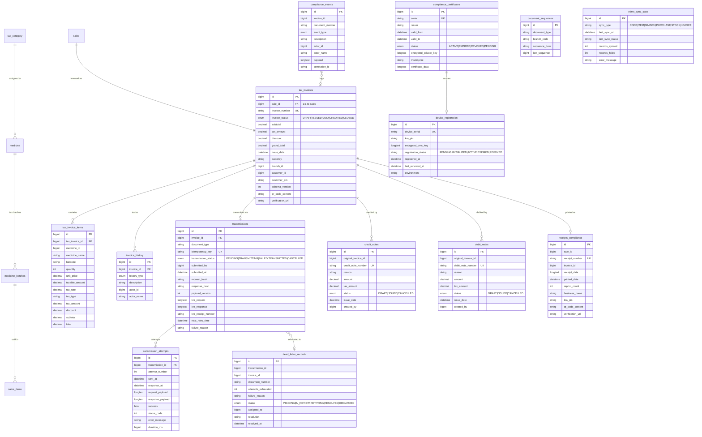
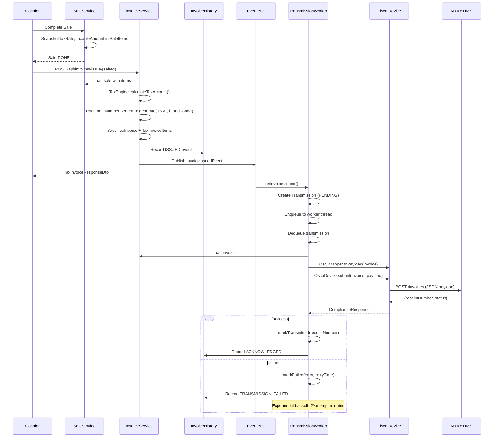
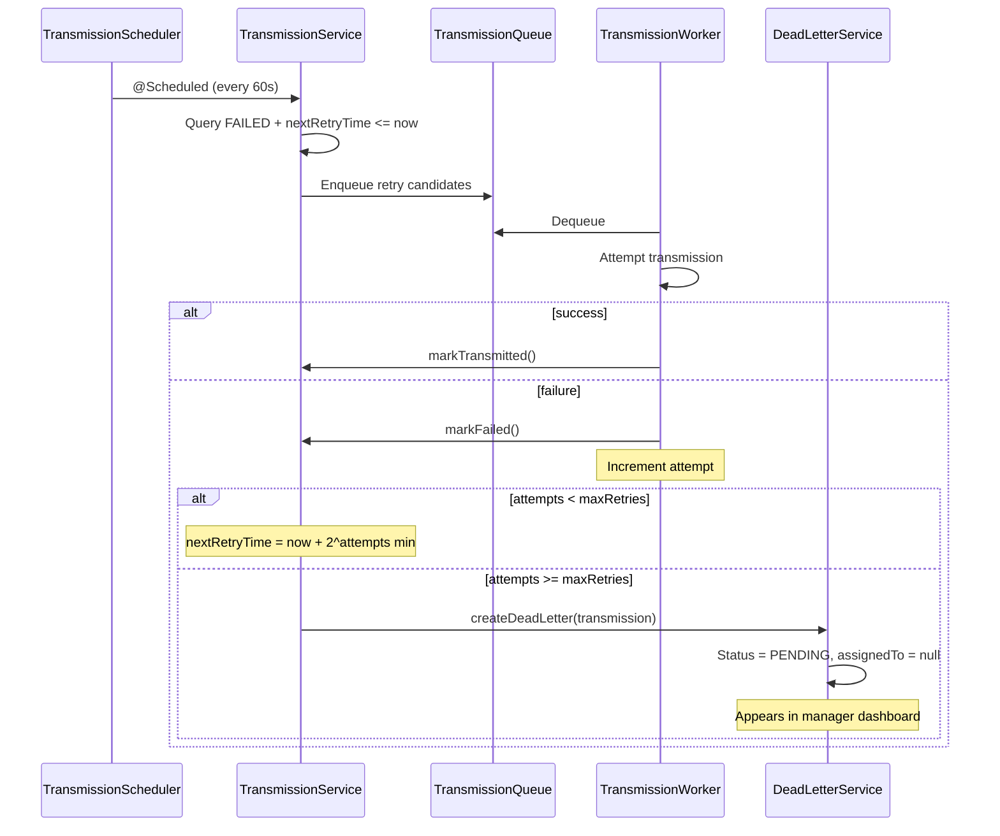
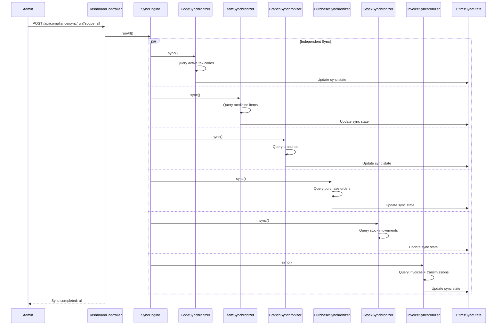
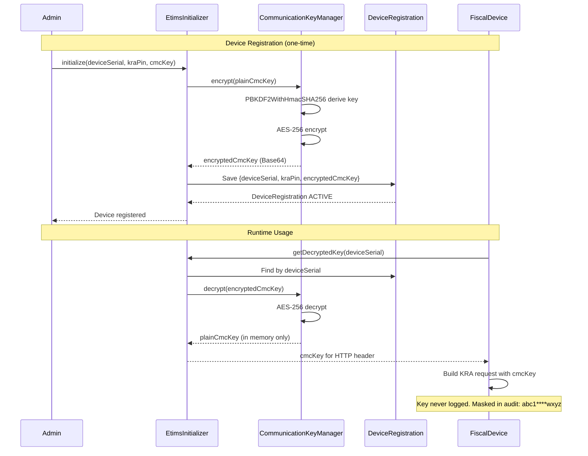

# Pharmacy POS API Reference v0.0.1

**Base URL:** `http://localhost:9090`

## Authentication

All endpoints except `/api/auth/**` require authentication via JWT stored in an `httpOnly` cookie (`jwt_token`).

For CSRF-protected environments: read `XSRF-TOKEN` cookie, send as `X-CSRF-TOKEN` header. CSRF is **disabled** by default for demo (`pos.security.csrf-enabled=false`).

### Login
```
POST /api/auth/login
Content-Type: application/json

{
  "email": "admin@demo.com",
  "password": "admin123"
}
```

**Response:** `ApiResponse<LoginResult>`
```json
{
  "success": true,
  "data": {
    "userId": 1,
    "email": "admin@demo.com",
    "name": "System Admin",
    "branchId": 1,
    "csrfToken": "abc123...",
    "expiresIn": 86400000
  }
}
```

### Refresh Token
```
POST /api/auth/refresh
Cookie: jwt_token=<token>
```

### Logout
```
POST /api/auth/logout
Cookie: jwt_token=<token>
```

---

## Generic Response Wrapper

All API responses use:
```json
{
  "success": true|false,
  "message": "human-readable message (optional)",
  "data": ...,
  "timestamp": "2026-07-21T17:00:00"
}
```

### Error Response
```json
{
  "success": false,
  "message": "Validation Failed",
  "errorCode": "VALIDATION_ERROR",
  "status": 400,
  "path": "/api/users",
  "timestamp": "2026-07-21T17:00:00",
  "validationErrors": [
    {"field": "email", "message": "must be a well-formed email address"}
  ]
}
```

---

## Endpoints

### 1. Pharmacy
| Method | Path | Auth |
|---|---|---|
| `POST` | `/api/pharmacies` | OWNER, PLATFORM_ADMIN |
| `GET` | `/api/pharmacies` | OWNER, PLATFORM_ADMIN |
| `GET` | `/api/pharmacies/{id}` | OWNER, PLATFORM_ADMIN |
| `PUT` | `/api/pharmacies/{id}` | OWNER, PLATFORM_ADMIN |
| `DELETE` | `/api/pharmacies/{id}` | OWNER, PLATFORM_ADMIN |

**PharmacyRequestDto:** `name`*, `address`*, `email`*, `phoneNumber`* (10-15 chars), `licenseNumber`*, `kraPin`*
**PharmacyResponseDto:** `id`, `name`, `address`, `email`, `phoneNumber`, `licenseNumber`, `kraPin`, `createdAt`, `updatedAt`

### 2. Branch
| Method | Path | Auth |
|---|---|---|
| `POST` | `/api/branches` | OWNER, PLATFORM_ADMIN |
| `GET` | `/api/branches` | OWNER, PLATFORM_ADMIN |
| `GET` | `/api/branches/{id}` | OWNER, PLATFORM_ADMIN |
| `PUT` | `/api/branches/{id}` | OWNER, PLATFORM_ADMIN |
| `DELETE` | `/api/branches/{id}` | OWNER, PLATFORM_ADMIN |

**BranchRequestDto:** `branchName`*, `branchCode`* (2-20 chars), `phoneNumber`* (10-15 chars), `email`, `location`*, `pharmacyId`*, `status`
**BranchResponseDto:** `id`, `branchName`, `branchCode`, `phoneNumber`, `email`, `location`, `pharmacyId`, `pharmacyName`, `status`, `createdAt`, `updatedAt`

### 3. System Settings
| Method | Path | Auth |
|---|---|---|
| `POST` | `/api/system-settings` | OWNER, BRANCH_MANAGER, PLATFORM_ADMIN |
| `GET` | `/api/system-settings` | OWNER, BRANCH_MANAGER, PLATFORM_ADMIN |
| `GET` | `/api/system-settings/{id}` | OWNER, BRANCH_MANAGER, PLATFORM_ADMIN |
| `PUT` | `/api/system-settings/{id}` | OWNER, BRANCH_MANAGER, PLATFORM_ADMIN |
| `DELETE` | `/api/system-settings/{id}` | OWNER, BRANCH_MANAGER, PLATFORM_ADMIN |

**SystemSettingsRequestDto:** `settingKey`*, `settingValue`*, `description`, `branchId`, `pharmacyId`*
**SystemSettingsResponseDto:** `id`, `settingKey`, `settingValue`, `description`, `pharmacyId`, `branchId`, `createdAt`, `updatedAt`

---

### 4. Users
| Method | Path | Auth |
|---|---|---|
| `POST` | `/api/users` | OWNER, PLATFORM_ADMIN |
| `GET` | `/api/users?branchId=` | OWNER, PLATFORM_ADMIN |
| `GET` | `/api/users/{id}` | OWNER, PLATFORM_ADMIN |
| `PUT` | `/api/users/{id}` | OWNER, PLATFORM_ADMIN |
| `PATCH` | `/api/users/{id}/status` | OWNER, PLATFORM_ADMIN |
| `PATCH` | `/api/users/{id}/password` | OWNER, PLATFORM_ADMIN |
| `DELETE` | `/api/users/{id}` | OWNER, PLATFORM_ADMIN |

**UserRequestDto:** `firstName`*, `middleName`, `lastName`*, `phoneNumber`* (10-15), `email`* (email format), `password`* (min 6), `branchId`*, `status`
**UserResponseDto:** `id`, `firstName`, `middleName`, `lastName`, `phoneNumber`, `email`, `status`, `branchId`, `branchName`, `lastLogin`, `createdAt`, `updatedAt`

**UpdateStatusRequestDto:** `status`* (ACTIVE|INACTIVE|TRANSFERRED)
**ChangePasswordRequestDto:** `currentPassword`*, `newPassword`* (min 6)

> On registration, a welcome email is sent with the temporary password (if SMTP is configured).

### 5. Login History
| Method | Path | Auth |
|---|---|---|
| `GET` | `/api/login-history?userId=` | OWNER, BRANCH_MANAGER, PLATFORM_ADMIN |

**LoginHistoryResponseDto:** `id`, `userId`, `userName`, `loginTime`, `logoutTime`, `ipAddress`, `device`, `browser`, `createdAt`

### 6. User Roles
| Method | Path | Auth |
|---|---|---|
| `POST` | `/api/roles` | OWNER, PLATFORM_ADMIN |
| `GET` | `/api/roles` | OWNER, PLATFORM_ADMIN |
| `GET` | `/api/roles/{id}` | OWNER, PLATFORM_ADMIN |
| `PUT` | `/api/roles/{id}` | OWNER, PLATFORM_ADMIN |
| `DELETE` | `/api/roles/{id}` | OWNER, PLATFORM_ADMIN |
| `POST` | `/api/roles/{id}/permissions` | OWNER, PLATFORM_ADMIN |
| `DELETE` | `/api/roles/{id}/permissions/{permissionId}` | OWNER, PLATFORM_ADMIN |

**UserRolesRequestDto:** `roleName`*
**UserRolesResponseDto:** `id`, `roleName`, `description`, `permissions`, `createdAt`, `updatedAt`

**AssignPermissionsRequestDto:** `permissionIds`* (list of permission IDs)

### 7. Permissions
| Method | Path | Auth |
|---|---|---|
| `POST` | `/api/permissions` | OWNER, PLATFORM_ADMIN |
| `GET` | `/api/permissions?module=` | OWNER, PLATFORM_ADMIN |
| `GET` | `/api/permissions/{id}` | OWNER, PLATFORM_ADMIN |
| `PUT` | `/api/permissions/{id}` | OWNER, PLATFORM_ADMIN |
| `DELETE` | `/api/permissions/{id}` | OWNER, PLATFORM_ADMIN |

**PermissionRequestDto:** `permissionName`*, `moduleName`*, `actionName`*, `description`
**PermissionResponseDto:** `id`, `permissionName`, `moduleName`, `actionName`, `description`, `createdAt`, `updatedAt`

### 8. User Branch Role
| Method | Path | Auth |
|---|---|---|
| `POST` | `/api/user-branch-roles` | OWNER, PLATFORM_ADMIN |
| `GET` | `/api/user-branch-roles?userId=&branchId=` | OWNER, PLATFORM_ADMIN |
| `DELETE` | `/api/user-branch-roles/{id}` | OWNER, PLATFORM_ADMIN |

**UserBranchRoleRequestDto:** `userId`*, `branchId`*, `roleId`*
**UserBranchRoleResponseDto:** `id`, `userId`, `userName`, `branchId`, `branchName`, `roleId`, `roleName`, `assignedById`, `assignedByName`, `assignedAt`, `createdAt`

### 9. Staff Shifts
| Method | Path | Auth |
|---|---|---|
| `POST` | `/api/shifts` | OWNER, BRANCH_MANAGER, CASHIER |
| `GET` | `/api/shifts?branchId=&userId=` | OWNER, BRANCH_MANAGER, CASHIER |
| `GET` | `/api/shifts/active?branchId=` | OWNER, BRANCH_MANAGER, CASHIER |
| `GET` | `/api/shifts/active/user/{userId}` | OWNER, BRANCH_MANAGER, CASHIER |
| `GET` | `/api/shifts/{id}` | OWNER, BRANCH_MANAGER, CASHIER |
| `PATCH` | `/api/shifts/{id}/close` | OWNER, BRANCH_MANAGER, CASHIER |
| `PATCH` | `/api/shifts/{id}/cancel` | OWNER, BRANCH_MANAGER, CASHIER |

**StaffShiftRequestDto:** `branchId`*, `userId`*, `roleId`, `shiftName`*, `shiftNumber`, `shiftStartTime`, `shiftEndTime`, `remarks`
**StaffShiftResponseDto:** `id`, `shiftName`, `shiftNumber`, `status`, `branchId`, `branchName`, `userId`, `userName`, `roleId`, `roleName`, `shiftStartTime`, `shiftEndTime`, `remarks`, `createdAt`, `updatedAt`

**UpdateShiftStatusDto:** `status`*, `remarks`

---

### 10. Categories
| Method | Path | Auth |
|---|---|---|
| `POST` | `/api/categories` | OWNER, BRANCH_MANAGER, STORE_KEEPER |
| `GET` | `/api/categories` | OWNER, BRANCH_MANAGER, STORE_KEEPER |
| `GET` | `/api/categories/{id}` | OWNER, BRANCH_MANAGER, STORE_KEEPER |
| `PUT` | `/api/categories/{id}` | OWNER, BRANCH_MANAGER, STORE_KEEPER |
| `DELETE` | `/api/categories/{id}` | OWNER, BRANCH_MANAGER, STORE_KEEPER |

**CategoryRequestDto:** `categoryName`*, `categoryDescription`
**CategoryResponseDto:** `id`, `categoryName`, `categoryDescription`, `createdAt`, `updatedAt`

### 11. Dosage Forms
| Method | Path | Auth |
|---|---|---|
| `POST` | `/api/dosage-forms` | OWNER, BRANCH_MANAGER, STORE_KEEPER |
| `GET` | `/api/dosage-forms` | OWNER, BRANCH_MANAGER, STORE_KEEPER |
| `GET` | `/api/dosage-forms/{id}` | OWNER, BRANCH_MANAGER, STORE_KEEPER |
| `PUT` | `/api/dosage-forms/{id}` | OWNER, BRANCH_MANAGER, STORE_KEEPER |
| `DELETE` | `/api/dosage-forms/{id}` | OWNER, BRANCH_MANAGER, STORE_KEEPER |

**DosageFormRequestDto:** `formName`*, `formDescription`
**DosageFormResponseDto:** `id`, `formName`, `formDescription`, `createdAt`, `updatedAt`

### 12. Units
| Method | Path | Auth |
|---|---|---|
| `POST` | `/api/units` | OWNER, BRANCH_MANAGER, STORE_KEEPER |
| `GET` | `/api/units` | OWNER, BRANCH_MANAGER, STORE_KEEPER |
| `GET` | `/api/units/{id}` | OWNER, BRANCH_MANAGER, STORE_KEEPER |
| `PUT` | `/api/units/{id}` | OWNER, BRANCH_MANAGER, STORE_KEEPER |
| `DELETE` | `/api/units/{id}` | OWNER, BRANCH_MANAGER, STORE_KEEPER |

**UnitRequestDto:** `unitName`*, `unitAbbreviation`
**UnitResponseDto:** `id`, `unitName`, `unitAbbreviation`, `createdAt`, `updatedAt`

### 13. Tax Categories
| Method | Path | Auth |
|---|---|---|
| `POST` | `/api/tax-categories` | OWNER, BRANCH_MANAGER |
| `GET` | `/api/tax-categories?activeOnly=` | OWNER, BRANCH_MANAGER |
| `GET` | `/api/tax-categories/code/{code}` | OWNER, BRANCH_MANAGER |
| `GET` | `/api/tax-categories/{id}` | OWNER, BRANCH_MANAGER |
| `PUT` | `/api/tax-categories/{id}` | OWNER, BRANCH_MANAGER |
| `PATCH` | `/api/tax-categories/{id}/toggle` | OWNER, BRANCH_MANAGER |
| `DELETE` | `/api/tax-categories/{id}` | OWNER, BRANCH_MANAGER |

**TaxRequestDto:** `code`*, `taxName`*, `taxDescription`, `taxRate`* (>=0), `taxType`* (VAT_STANDARD|VAT_REDUCED|VAT_ZERO|EXEMPT|OUT_OF_SCOPE), `active` (default true)

**TaxResponseDto:** `id`, `code`, `taxName`, `taxDescription`, `taxRate`, `taxType`, `active`, `createdAt`, `updatedAt`

> **PATCH /{id}/toggle**: Toggles the `active` flag. Cannot delete if assigned to any medicines.
> The `taxRate` and `taxType` are snapshotted into SaleItems and TaxInvoiceItems at sale time — changing them later does not affect historical data.

### 14. Manufacturers
| Method | Path | Auth |
|---|---|---|
| `POST` | `/api/manufacturers` | OWNER, BRANCH_MANAGER, STORE_KEEPER |
| `GET` | `/api/manufacturers` | OWNER, BRANCH_MANAGER, STORE_KEEPER |
| `GET` | `/api/manufacturers/{id}` | OWNER, BRANCH_MANAGER, STORE_KEEPER |
| `PUT` | `/api/manufacturers/{id}` | OWNER, BRANCH_MANAGER, STORE_KEEPER |
| `DELETE` | `/api/manufacturers/{id}` | OWNER, BRANCH_MANAGER, STORE_KEEPER |

**ManufacturerRequestDto:** `manufacturerName`*, `manufacturerCountry`, `manufacturerContact`
**ManufacturerResponseDto:** `id`, `manufacturerName`, `manufacturerCountry`, `manufacturerContact`, `createdAt`, `updatedAt`

### 15. Medicines
| Method | Path | Auth |
|---|---|---|
| `POST` | `/api/medicines` | OWNER, BRANCH_MANAGER, PHARMACIST, STORE_KEEPER |
| `GET` | `/api/medicines?categoryId=&manufacturerId=&controlled=` | OWNER, BRANCH_MANAGER, PHARMACIST, STORE_KEEPER |
| `GET` | `/api/medicines/barcode/{barcode}` | OWNER, BRANCH_MANAGER, PHARMACIST, STORE_KEEPER |
| `GET` | `/api/medicines/{id}` | OWNER, BRANCH_MANAGER, PHARMACIST, STORE_KEEPER |
| `PUT` | `/api/medicines/{id}` | OWNER, BRANCH_MANAGER, PHARMACIST, STORE_KEEPER |
| `DELETE` | `/api/medicines/{id}` | OWNER, BRANCH_MANAGER, PHARMACIST, STORE_KEEPER |

**MedicineRequestDto:** `barcode`*, `sku`, `brandName`*, `genericName`*, `strength`, `manufacturerId`*, `medicineCategoriesId`*, `dosageFormId`, `unitId`, `taxId`, `requiresPrescription`, `description`, `maximumDispenseQuantity`, `minimumAge`, `requiresRefrigeration`, `isControlledDrug`, `status`
**MedicineResponseDto:** `id`, `barcode`, `sku`, `brandName`, `genericName`, `strength`, `status`, `manufacturerId`, `manufacturerName`, `medicineCategoriesId`, `categoryName`, `dosageFormId`, `dosageFormName`, `unitId`, `unitName`, `taxId`, `taxName`, `requiresPrescription`, `description`, `maximumDispenseQuantity`, `minimumAge`, `requiresRefrigeration`, `isControlledDrug`, `createdAt`, `updatedAt`

---

### 16. Medicine Batches (Inventory)
| Method | Path | Auth |
|---|---|---|
| `POST` | `/api/batches` | OWNER, BRANCH_MANAGER, STORE_KEEPER |
| `GET` | `/api/batches` | OWNER, BRANCH_MANAGER, STORE_KEEPER |
| `GET` | `/api/batches/expiring` | OWNER, BRANCH_MANAGER, STORE_KEEPER |
| `GET` | `/api/batches/available` | OWNER, BRANCH_MANAGER, STORE_KEEPER |
| `PUT` | `/api/batches/{id}` | OWNER, BRANCH_MANAGER, STORE_KEEPER |
| `DELETE` | `/api/batches/{id}` | OWNER, BRANCH_MANAGER, STORE_KEEPER |

**MedicineBatchRequestDto:** `medicineId`*, `batchNumber`*, `manufactureDate`, `expirationDate`, `initialQuantity`*, `buyingPrice`*, `sellingPrice`*
**MedicineBatchResponseDto:** `id`, `medicineId`, `medicineName`, `batchNumber`, `manufactureDate`, `expirationDate`, `initialQuantity`, `currentQuantity`, `buyingPrice`, `sellingPrice`, `status`, `createdAt`, `updatedAt`

### 17. Stock
| Method | Path | Auth |
|---|---|---|
| `POST` | `/api/stock` | OWNER, BRANCH_MANAGER, STORE_KEEPER |
| `GET` | `/api/stock` | OWNER, BRANCH_MANAGER, STORE_KEEPER |
| `POST` | `/api/stock/receive` | OWNER, BRANCH_MANAGER, STORE_KEEPER |
| `POST` | `/api/stock/deduct` | OWNER, BRANCH_MANAGER, STORE_KEEPER |
| `GET` | `/api/stock/low-stock` | OWNER, BRANCH_MANAGER, STORE_KEEPER |

**StockRequestDto:** `medicineBatchesId`*, `branchId`*, `quantityAvailable` (>=0), `reservedQuantity` (>=0), `minimumStock` (>=0), `maximumStock` (>=0), `reorderLevel` (>=0), `shelfLocation`, `lastStockDate`
**StockAdjustmentDto:** `branchId`*, `medicineBatchesId`*, `quantity`* (>0)
**StockResponseDto:** `id`, `medicineBatchesId`, `batchNumber`, `medicineId`, `medicineName`, `branchId`, `branchName`, `quantityAvailable`, `reservedQuantity`, `minimumStock`, `maximumStock`, `reorderLevel`, `shelfLocation`, `lastStockDate`, `createdAt`, `updatedAt`

### 18. Stock Movements
| Method | Path | Auth |
|---|---|---|
| `POST` | `/api/stock-movements` | OWNER, BRANCH_MANAGER, STORE_KEEPER |
| `GET` | `/api/stock-movements?batchId=` | OWNER, BRANCH_MANAGER, STORE_KEEPER |
| `GET` | `/api/stock-movements/{id}` | OWNER, BRANCH_MANAGER, STORE_KEEPER |

**StockMovementRequestDto:** `movementType`*, `medicineBatchesId`*, `userId`*, `branchId`*, `referenceType`, `referenceId`, `movementDate`
**StockMovementResponseDto:** `id`, `movementType`, `movementDate`, `medicineBatchId`, `userId`, `branchId`, `referenceType`, `referenceId`, `createdAt`

---

### 19. Sales
| Method | Path | Auth |
|---|---|---|
| `POST` | `/api/sales` | OWNER, BRANCH_MANAGER, CASHIER, PHARMACIST |
| `GET` | `/api/sales?branchId=` | OWNER, BRANCH_MANAGER, CASHIER, PHARMACIST |
| `GET` | `/api/sales/suspended?branchId=` | OWNER, BRANCH_MANAGER, CASHIER, PHARMACIST |
| `GET` | `/api/sales/last?userId=&branchId=` | OWNER, BRANCH_MANAGER, CASHIER, PHARMACIST |
| `GET` | `/api/sales/{id}` | OWNER, BRANCH_MANAGER, CASHIER, PHARMACIST |
| `PATCH` | `/api/sales/{id}/cancel` | OWNER, BRANCH_MANAGER, CASHIER |
| `PATCH` | `/api/sales/{id}/suspend` | OWNER, BRANCH_MANAGER, CASHIER |
| `PATCH` | `/api/sales/{id}/resume` | OWNER, BRANCH_MANAGER, CASHIER |
| `PATCH` | `/api/sales/{id}/items/{itemId}/override-price` | OWNER, BRANCH_MANAGER |

**SaleRequestDto:** `branchId`*, `userId`*, `customerId`, `invoiceNumber`, `idempotencyKey`, `items`* (array), `payments` (array)

**SaleItemDto (nested):** `medicineBatchesId`*, `quantity`* (>0), `price`*, `discount`, `tax`
**PaymentItemDto (nested):** `paymentMethod`* (CASH|M_PESA|CARD), `amount`* (>0), `currency`, `transactionReference`

**SaleResponseDto:** `id`, `invoiceNumber`, `saleStatus` (DONE|CANCELLED|SUSPENDED), `paymentStatus` (PAID|NOT_PAID|IN_PROGRESS), `subtotal`, `tax`, `total`, `branchId`, `branchName`, `userId`, `userName`, `customerId`, `customerName`, `items`, `payments`, `createdAt`, `updatedAt`

**Suspend:** Restocks items, marks sale as SUSPENDED. Cannot suspend paid or already cancelled sales.
**Resume:** Re-deducts stock. Fails if stock is now insufficient. Only SUSPENDED sales can be resumed.
**Override Price:** `{"newPrice": 150.00, "reason": "Manager approval"}` — recalculates item total and sale subtotal.

### 20. Sale Returns
| Method | Path | Auth |
|---|---|---|
| `POST` | `/api/sales/returns` | OWNER, BRANCH_MANAGER, CASHIER |

**SaleReturnRequestDto:** `saleId`*, `userId`*, `reason`*, `items`* (array of `{medicineId, batchId, quantity}`)
**SaleReturnResponseDto:** `id`, `saleId`, `invoiceNumber`, `userId`, `reason`, `totalRefund`, `items`, `createdAt`

### 21. Payments
| Method | Path | Auth |
|---|---|---|
| `POST` | `/api/payments` | OWNER, CASHIER |
| `POST` | `/api/payments/{id}/process?phoneNumber=` | OWNER, CASHIER |
| `GET` | `/api/payments/{id}/status` | OWNER, CASHIER |
| `POST` | `/api/payments/{id}/refund` | OWNER, BRANCH_MANAGER |
| `GET` | `/api/payments?saleId=` | OWNER, CASHIER |
| `POST` | `/api/payments/mpesa/callback` | **No auth** (public) |

**PaymentRequestDto:** `saleId`*, `paymentMethod`* (CASH|M_PESA|CARD), `amount`* (>0), `currency`, `transactionReference`, `description`, `phoneNumber`

**PaymentGatewayResponse:** `success`, `transactionReference`, `status` (PENDING|PROCESSING|COMPLETED|FAILED|CANCELLED|REFUNDED), `responseCode`, `responseDescription`, `merchantRequestId`, `checkoutRequestId`

**Flow:**
1. `POST /api/payments` — records payment, auto-processes via gateway. CASH completes immediately. M_PESA returns `PENDING` (STK Push initiated). CARD returns `PENDING`.
2. `POST /api/payments/{id}/process` — manually (re)trigger gateway processing with phone number override.
3. `GET /api/payments/{id}/status` — query payment status from the gateway. M_PESA confirms STK Push.
4. `POST /api/payments/mpesa/callback` — Safaricom hits this endpoint on STK Push completion. Auto-updates payment to COMPLETED/FAILED.
5. `POST /api/payments/{id}/refund` — reverses a COMPLETED payment through the gateway.

> Sale `paymentStatus` auto-updates: `NOT_PAID` → `IN_PROGRESS` (partial) → `PAID` (all COMPLETED payments >= total).

---

### 22. Suppliers
| Method | Path | Auth |
|---|---|---|
| `POST` | `/api/suppliers` | OWNER, BRANCH_MANAGER, STORE_KEEPER |
| `GET` | `/api/suppliers` | OWNER, BRANCH_MANAGER, STORE_KEEPER |
| `GET` | `/api/suppliers/{id}` | OWNER, BRANCH_MANAGER, STORE_KEEPER |
| `PUT` | `/api/suppliers/{id}` | OWNER, BRANCH_MANAGER, STORE_KEEPER |
| `DELETE` | `/api/suppliers/{id}` | OWNER, BRANCH_MANAGER, STORE_KEEPER |

**SupplierRequestDto:** `supplierName`*, `licenseNumber`, `phoneNumber`, `address`, `email`, `contactPerson`, `paymentTerms`, `status`
**SupplierResponseDto:** `id`, `supplierName`, `licenseNumber`, `phoneNumber`, `address`, `email`, `contactPerson`, `paymentTerms`, `status`, `createdAt`

### 23. Purchase Orders
| Method | Path | Auth |
|---|---|---|
| `POST` | `/api/purchase-orders` | OWNER, BRANCH_MANAGER, STORE_KEEPER |
| `GET` | `/api/purchase-orders?status=&supplierId=` | OWNER, BRANCH_MANAGER, STORE_KEEPER |
| `GET` | `/api/purchase-orders/{id}` | OWNER, BRANCH_MANAGER, STORE_KEEPER |
| `PUT` | `/api/purchase-orders/{id}/approve` | OWNER, BRANCH_MANAGER |
| `PUT` | `/api/purchase-orders/{id}/deliver` | OWNER, BRANCH_MANAGER, STORE_KEEPER |

**PurchaseOrderRequestDto:** `supplierId`*, `branchId`*, `orderedById`*, `expectedDeliveryDate`, `items`* (array of `{medicineId, batchId, quantity, unitPrice}`)

**PurchaseOrderResponseDto:** `id`, `supplierId`, `supplierName`, `branchId`, `orderedById`, `orderDate`, `expectedDeliveryDate`, `status` (PENDING|APPROVED|ORDERED|DELIVERED|CANCELLED), `items`, `createdAt`

### 24. Goods Received Notes
| Method | Path | Auth |
|---|---|---|
| `POST` | `/api/goods-received` | OWNER, BRANCH_MANAGER, STORE_KEEPER |
| `GET` | `/api/goods-received` | OWNER, BRANCH_MANAGER, STORE_KEEPER |
| `GET` | `/api/goods-received/{id}` | OWNER, BRANCH_MANAGER, STORE_KEEPER |

**GoodsReceivedRequestDto:** `purchaseOrdersId`*, `userId`*, `remarks`
**GoodsReceivedResponseDto:** `id`, `purchaseOrderId`, `userId`, `userName`, `receivedDate`, `remarks`, `createdAt`

> Automatically sets PO status to `DELIVERED`.

### 25. Supplier Invoices
| Method | Path | Auth |
|---|---|---|
| `POST` | `/api/supplier-invoices` | OWNER, BRANCH_MANAGER, STORE_KEEPER |
| `GET` | `/api/supplier-invoices?supplierId=` | OWNER, BRANCH_MANAGER, STORE_KEEPER |
| `GET` | `/api/supplier-invoices/{id}` | OWNER, BRANCH_MANAGER, STORE_KEEPER |

**SupplierInvoiceRequestDto:** `supplierId`*, `invoiceNumber`*, `subTotal`* (>0), `tax`, `total`* (>0)
**SupplierInvoiceResponseDto:** `id`, `supplierId`, `supplierName`, `invoiceNumber`, `subTotal`, `tax`, `total`, `status` (UNPAID|PARTIAL|PAID), `createdAt`

### 26. Supplier Payments
| Method | Path | Auth |
|---|---|---|
| `POST` | `/api/supplier-payments` | OWNER, BRANCH_MANAGER, STORE_KEEPER |
| `GET` | `/api/supplier-payments?supplierInvoiceId=` | OWNER, BRANCH_MANAGER, STORE_KEEPER |

**SupplierPaymentRequestDto:** `supplierInvoiceId`*, `userId`*, `paymentMethod`*, `paymentAmount`* (>0), `paymentReference`
**SupplierPaymentResponseDto:** `id`, `supplierInvoiceId`, `userId`, `paymentMethod`, `paymentAmount`, `paymentReference`, `paymentDate`

> Auto-updates invoice `balanceDue` and `status`.

### 27. Price History
| Method | Path | Auth |
|---|---|---|
| `GET` | `/api/price-history?medicineId=&batchId=` | OWNER, BRANCH_MANAGER, STORE_KEEPER |

**PriceHistoryResponseDto:** `id`, `medicineId`, `medicineName`, `medicineBatchId`, `batchNumber`, `userId`, `userName`, `oldBuyingPrice`, `oldSellingPrice`, `newBuyingPrice`, `newSellingPrice`, `changedAt`, `createdAt`

> One of `medicineId` or `batchId` is required.

---

### 28. Expenses
| Method | Path | Auth |
|---|---|---|
| `POST` | `/api/expenses` | OWNER, BRANCH_MANAGER |
| `GET` | `/api/expenses?categoryId=&branchId=` | OWNER, BRANCH_MANAGER |
| `GET` | `/api/expenses/{id}` | OWNER, BRANCH_MANAGER |

**ExpensesRequestDto:** `expenseCategoryId`*, `cashDrawersId`, `userId`*, `amount`* (>0), `description`
**ExpensesResponseDto:** `id`, `expenseCategoryId`, `categoryName`, `cashDrawersId`, `userId`, `userName`, `amount`, `description`, `createdAt`

### 29. Expense Categories
| Method | Path | Auth |
|---|---|---|
| `POST` | `/api/expense-categories` | OWNER, BRANCH_MANAGER |
| `GET` | `/api/expense-categories` | OWNER, BRANCH_MANAGER |
| `GET` | `/api/expense-categories/{id}` | OWNER, BRANCH_MANAGER |
| `PUT` | `/api/expense-categories/{id}` | OWNER, BRANCH_MANAGER |
| `DELETE` | `/api/expense-categories/{id}` | OWNER, BRANCH_MANAGER |

**ExpenseCategoryRequestDto:** `categoryName`*, `categoryDescription`
**ExpenseCategoryResponseDto:** `id`, `categoryName`, `categoryDescription`, `createdAt`, `updatedAt`

### 30. Cash Drawers
| Method | Path | Auth |
|---|---|---|
| `POST` | `/api/cash-drawers` | OWNER, BRANCH_MANAGER, CASHIER |
| `GET` | `/api/cash-drawers?branchId=&status=` | OWNER, BRANCH_MANAGER, CASHIER |
| `PUT` | `/api/cash-drawers/{id}/close` | OWNER, BRANCH_MANAGER |

**CashDrawerRequestDto:** `staffShiftsId`*, `openingBalance`, `expectedClosingBalance`, `actualClosingBalance`, `variance`
**CashDrawerResponseDto:** `id`, `staffShiftsId`, `openingBalance`, `expectedClosingBalance`, `actualClosingBalance`, `variance`, `status` (OPEN|CLOSED), `createdAt`

### 31. Cash Transactions
| Method | Path | Auth |
|---|---|---|
| `GET` | `/api/cash-transactions?cashDrawerId=` | OWNER, BRANCH_MANAGER, CASHIER |

**CashTransactionResponseDto:** `id`, `cashDrawerId`, `transactionType`, `amount`, `remarks`, `referenceType`, `referenceId`, `createdAt`

---

### 32. Prescriptions
| Method | Path | Auth |
|---|---|---|
| `POST` | `/api/prescriptions` | OWNER, PHARMACIST |
| `GET` | `/api/prescriptions` | OWNER, PHARMACIST |
| `GET` | `/api/prescriptions/{id}` | OWNER, PHARMACIST |
| `PUT` | `/api/prescriptions/{id}/dispense` | OWNER, PHARMACIST |

**PrescriptionRequestDto:** `customerName`*, `doctorName`, `doctorLicenseNumber`, `hospitalName`, `prescriptionNumber`, `diagnosis`, `issuedDate`, `items`* (array of `{medicineId, quantity, dosage}`)

**PrescriptionResponseDto:** `id`, `customerName`, `doctorName`, `prescriptionNumber`, `status` (ACTIVE|DISPENSED|CANCELLED), `items`, `createdAt`, `dispensedAt`

### 33. Dispensary
| Method | Path | Auth |
|---|---|---|
| `POST` | `/api/dispensary` | OWNER, PHARMACIST |
| `GET` | `/api/dispensary` | OWNER, PHARMACIST |
| `GET` | `/api/dispensary/{id}` | OWNER, PHARMACIST |

**DispensaryRequestDto:** `medicineBatchesId`*, `userId`*, `prescriptionItemsId`*, `dispensedQuantity`* (>0)
**DispensaryResponseDto:** `id`, `prescriptionItemId`, `medicineBatchId`, `batchNumber`, `dispensedQuantity`, `dispensedAt`

---

### 34. Compliance — Tax Invoices
| Method | Path | Auth |
|---|---|---|
| `POST` | `/api/invoices/issue/{saleId}` | OWNER, BRANCH_MANAGER, CASHIER, PHARMACIST |
| `GET` | `/api/invoices/{id}` | OWNER, BRANCH_MANAGER, CASHIER, PHARMACIST |
| `GET` | `/api/invoices/by-sale/{saleId}` | OWNER, BRANCH_MANAGER, CASHIER, PHARMACIST |
| `GET` | `/api/invoices?branchId=&status=&from=&to=` | OWNER, BRANCH_MANAGER, CASHIER, PHARMACIST |
| `POST` | `/api/invoices/{id}/cancel` | OWNER, BRANCH_MANAGER |
| `GET` | `/api/invoices/{id}/history` | OWNER, BRANCH_MANAGER, CASHIER, PHARMACIST |
| `POST` | `/api/invoices/{id}/credit-notes` | OWNER, BRANCH_MANAGER, FINANCE |
| `GET` | `/api/invoices/{id}/credit-notes` | OWNER, BRANCH_MANAGER, FINANCE |
| `POST` | `/api/invoices/{id}/debit-notes` | OWNER, BRANCH_MANAGER, FINANCE |
| `GET` | `/api/invoices/{id}/debit-notes` | OWNER, BRANCH_MANAGER, FINANCE |

**Issue Invoice:** Creates a `TaxInvoice` from a completed sale. Query params: `customerPin`, `currency`, `actorId`, `actorName`. Each item snapshots `unitPrice`, `taxableAmount`, `taxRate`, `taxType`, `taxAmount` — never recalculated.

**TaxInvoiceResponseDto:** `id`, `saleId`, `invoiceNumber`, `invoiceStatus` (DRAFT|ISSUED|VOID|CREDITED|CLOSED), `subtotal`, `taxAmount`, `discount`, `grandTotal`, `issueDate`, `currency`, `branchId`, `customerId`, `customerName`, `customerPin`, `schemaVersion`, `qrCodeContent`, `qrImagePath`, `verificationUrl`, `items[]`, `history[]`, `createdAt`, `updatedAt`

**TaxInvoiceItemResponse:** `id`, `medicineId`, `medicineName`, `barcode`, `quantity`, `unitPrice`, `taxableAmount`, `taxRate`, `taxType`, `taxAmount`, `discount`, `subtotal`, `total`

**Invoice History Response:** `id`, `historyType` (CREATED|ISSUED|SENT_TO_KRA|ACKNOWLEDGED|REPRINTED|CREDIT_NOTE_ISSUED|DEBIT_NOTE_ISSUED|VOID|CLOSED|TRANSMISSION_FAILED), `description`, `actorId`, `actorName`, `createdAt`

> Invoices are **immutable** after issuance. Use credit/debit notes for corrections. Cannot cancel an invoice already transmitted to KRA.

**CreditNoteResponseDto:** `id`, `originalInvoiceId`, `creditNoteNumber`, `reason`, `amount`, `taxAmount`, `status` (DRAFT|ISSUED|CANCELLED), `issueDate`, `createdBy`, `createdAt`

**DebitNoteResponseDto:** `id`, `originalInvoiceId`, `debitNoteNumber`, `reason`, `amount`, `taxAmount`, `status` (DRAFT|ISSUED|CANCELLED), `issueDate`, `createdBy`, `createdAt`

> Credit note validation: total of all non-cancelled credit notes cannot exceed original invoice grand total.

### 34b. Compliance — eTIMS Transmission
| Method | Path | Auth |
|---|---|---|
| `POST` | `/api/etims/transmit/{invoiceId}` | OWNER, BRANCH_MANAGER, FINANCE |
| `GET` | `/api/etims/transmissions/{id}` | OWNER, BRANCH_MANAGER, FINANCE |
| `GET` | `/api/etims/transmissions/by-invoice/{invoiceId}` | OWNER, BRANCH_MANAGER, FINANCE |
| `POST` | `/api/etims/retry/{transmissionId}` | OWNER, BRANCH_MANAGER, FINANCE |
| `POST` | `/api/etims/retry-all` | OWNER, BRANCH_MANAGER, FINANCE |
| `GET` | `/api/etims/health` | OWNER, BRANCH_MANAGER, FINANCE |

**TransmissionResponseDto:** `id`, `invoiceId`, `documentType`, `transmissionStatus` (PENDING|TRANSMITTING|FAILED|TRANSMITTED|CANCELLED), `submittedBy`, `submittedAt`, `requestHash`, `responseHash`, `payloadVersion`, `kraReceiptNumber`, `failureReason`, `nextRetryTime`, `attempts[]`, `createdAt`

**AttemptResponse:** `id`, `attemptNumber`, `sentAt`, `responseAt`, `success`, `statusCode`, `errorMessage`, `durationMs`

> **Flow:** `POST /transmit/{invoiceId}` → Creates Transmission record → Enqueued to in-memory worker → Marked TRANSMITTING → OSCU/VSCU gateway called → On success: TRANSMITTED + KRA receipt stored. On failure: FAILED + exponential backoff retry schedule. Each attempt stored with full request/response payloads and SHA-256 hashes for audit.

### 34c. Compliance — Receipts (Compliance-Grade)
| Method | Path | Auth |
|---|---|---|
| `POST` | `/api/compliance/receipts` | OWNER, BRANCH_MANAGER, CASHIER |
| `GET` | `/api/compliance/receipts/{id}` | OWNER, BRANCH_MANAGER, CASHIER, PHARMACIST |
| `GET` | `/api/compliance/receipts/by-sale/{saleId}` | OWNER, BRANCH_MANAGER, CASHIER, PHARMACIST |
| `POST` | `/api/compliance/receipts/{id}/reprint` | OWNER, BRANCH_MANAGER, CASHIER |

**Receipt entity** stores a permanent snapshot: `saleId`, `receiptNumber`, `invoiceId`, `receiptData` (JSON), `printedDate`, `reprintCount`, `businessName`, `kraPin`, `qrCodeContent`, `verificationUrl`. Never regenerated from product prices — safe to reprint years later.

### 34d. Compliance — Dashboard, Health & Sync
| Method | Path | Auth |
|---|---|---|
| `GET` | `/api/compliance/dashboard` | OWNER, BRANCH_MANAGER, FINANCE |
| `GET` | `/api/compliance/health` | OWNER, BRANCH_MANAGER, FINANCE |
| `GET` | `/api/compliance/sync/status` | OWNER, BRANCH_MANAGER, FINANCE |
| `POST` | `/api/compliance/sync/run?scope=all` | OWNER, BRANCH_MANAGER |
| `POST` | `/api/compliance/certification/run` | OWNER, BRANCH_MANAGER |
| `POST` | `/api/compliance/certification/generate-demo-data` | OWNER, BRANCH_MANAGER |
| `POST` | `/api/compliance/certification/export` | OWNER, BRANCH_MANAGER |

**ComplianceDashboardDto:** `mode` (MOCK|SANDBOX|CERTIFICATION|PRODUCTION), `activeProvider` (OSCU|VSCU), `invoicesToday`, `transmissionsPending`, `transmissionsFailed`, `transmissionsTransmitted`, `deadLetterCount`, `retryQueueSize`, `oscuStatus`, `vscuStatus`, `certificateStatus`, `certificateExpiring`, `lastSuccess`, `lastFailure`, `averageApiTimeMs`

**Health Response:** `{status, mode, activeProvider, transmissionsPending, transmissionsFailed, transmissionsTransmitted, deadLetterCount, oscuHealth, vscuHealth, activeCertificates, certificateWarning?}`

**Sync scopes:** `all`, `CODE`, `ITEM`, `BRANCH`, `PURCHASE`, `STOCK`, `INVOICE` — each runs the corresponding synchronizer independently.

**Certification Suite:** Runs 4 test scenarios (invoice generation, tax calculation, credit note, synchronization). Returns per-scenario PASS/FAIL with timing and details. Export collects invoices, transmissions, and compliance events.

### 34e. Compliance — Controlled Drugs & Expiry
| Method | Path | Auth |
|---|---|---|
| `POST` | `/api/controlled-drugs` | OWNER, PHARMACIST |
| `GET` | `/api/controlled-drugs` | OWNER, PHARMACIST |
| `POST` | `/api/expiry-logs` | OWNER, BRANCH_MANAGER, STORE_KEEPER |
| `GET` | `/api/expiry-logs` | OWNER, BRANCH_MANAGER, STORE_KEEPER |

**ControlledDrugsRequestDto:** `medicineId`*, `prescriptionId`*, `userId`*, `quantityDispensed`*
**ExpiryLogRequestDto:** `medicineBatchesId`*, `userId`*, `disposalMethod`*

---

### 35. Customers
| Method | Path | Auth |
|---|---|---|
| `POST` | `/api/customers` | OWNER, BRANCH_MANAGER, CASHIER, PHARMACIST |
| `GET` | `/api/customers` | OWNER, BRANCH_MANAGER, CASHIER, PHARMACIST |
| `GET` | `/api/customers/{id}` | OWNER, BRANCH_MANAGER, CASHIER, PHARMACIST |
| `GET` | `/api/customers/phone/{phone}` | OWNER, BRANCH_MANAGER, CASHIER, PHARMACIST |
| `PUT` | `/api/customers/{id}` | OWNER, BRANCH_MANAGER, CASHIER, PHARMACIST |
| `PATCH` | `/api/customers/{id}/loyalty-points` | OWNER, BRANCH_MANAGER, CASHIER |

**CustomerRequestDto:** `firstName`*, `lastName`, `phoneNumber`, `email`, `address`, `notes`
**CustomerResponseDto:** `id`, `firstName`, `lastName`, `phoneNumber`, `email`, `address`, `notes`, `loyaltyPoints`, `createdAt`

---

### 36. Notifications
| Method | Path | Auth |
|---|---|---|
| `GET` | `/api/notifications?branchId=` | All authenticated |
| `PATCH` | `/api/notifications/{id}/read` | All authenticated |
| `PATCH` | `/api/notifications/{id}/dismiss` | All authenticated |

**NotificationResponseDto:** `id`, `branchId`, `userId`, `title`, `message`, `type` (LOW_STOCK|EXPIRY_WARNING|SALE_COMPLETED|SHIFT_REMINDER|SYSTEM_ALERT), `status` (UNREAD|READ|DISMISSED), `createdAt`

---

### 37. Reporting & Dashboard
| Method | Path | Auth |
|---|---|---|
| `GET` | `/api/reports/dashboard?branchId=` | OWNER, BRANCH_MANAGER |

**Response:** `{todaySalesCount, todaySalesTotal, lowStockCount, totalStockItems}`

---

### 38. Audit Logs
| Method | Path | Auth |
|---|---|---|
| `GET` | `/api/audit-logs?tableName=&recordId=` | OWNER, BRANCH_MANAGER, PLATFORM_ADMIN |
| `GET` | `/api/audit-logs/{id}` | OWNER, BRANCH_MANAGER, PLATFORM_ADMIN |

**AuditLogResponseDto:** `id`, `tableName`, `recordId`, `action`, `oldValue`, `newValue`, `userId`, `userEmail`, `timestamp`

---

### 39. Receipts
| Method | Path | Auth |
|---|---|---|
| `GET` | `/api/receipts/{saleId}` | OWNER, BRANCH_MANAGER, CASHIER, PHARMACIST |
| `GET` | `/api/receipts/{saleId}/print` | OWNER, BRANCH_MANAGER, CASHIER, PHARMACIST |

**GET /{saleId}** returns `ReceiptData` JSON with store branding, items, totals, payment methods, footer, and return policy — for on-screen preview.

**GET /{saleId}/print** returns raw ESC/POS text for thermal printer. Contains bold totals, paper cut command (`\x1d\x56\x42\x00`). Send this to the Python hardware connector at `POST http://localhost:9100/print`.

**ReceiptData:** `storeName`, `branchName`, `address`, `phone`, `invoiceNumber`, `dateTime`, `cashier`, `currency`, `items` (array of `{number, name, batchNumber, qty, unitPrice, discount, total}`), `subtotal`, `tax`, `total`, `paymentMethods`, `footerText`, `thankYou`, `returnPolicy`

---

### 40. POS Quick Operations
| Method | Path | Auth |
|---|---|---|
| `GET` | `/api/pos/lookup?barcode=&name=&branchId=` | OWNER, BRANCH_MANAGER, CASHIER, PHARMACIST |
| `GET` | `/api/pos/quick-items?branchId=` | OWNER, BRANCH_MANAGER, CASHIER, PHARMACIST |

**Lookup:** Returns matching medicines with live stock availability and per-batch pricing. Designed for barcode scan or name search at the till.
- Response per medicine: `{id, barcode, brandName, genericName, strength, requiresPrescription, isControlledDrug, stockAvailable, batches: [{batchId, batchNumber, available, sellingPrice, expirationDate}]}`

**Quick-items:** All in-stock items for the branch. Lightweight format for cashier product grid.

---

### 41. Z-Report (Shift End-of-Day)
| Method | Path | Auth |
|---|---|---|
| `GET` | `/api/reports/shift-z/{shiftId}` | OWNER, BRANCH_MANAGER |

**ShiftReport:** `shiftId`, `shiftName`, `branchName`, `cashierName`, `openedAt`, `closedAt`, `status`, `openingBalance`, `expectedClosingBalance`, `actualClosingBalance`, `variance`, `salesCount`, `totalSales`, `totalCashPayments`, `totalMpesaPayments`, `totalCardPayments`, `totalExpenses`, `totalRefunds`, `refundCount`, `paymentBreakdown` (array by method), `expenseBreakdown`, `refundBreakdown`

Provides full shift reconciliation: cash drawer variance, payment method breakdown, expenses, and refunds.

---

### 42. Hardware Bridge
| Method | Path | Auth |
|---|---|---|
| `GET` | `/api/hardware/config` | OWNER, BRANCH_MANAGER, CASHIER |
| `GET` | `/api/hardware/status` | OWNER, BRANCH_MANAGER, CASHIER |

**Config:** Returns `{connectorUrl: "http://localhost:9100", endpoints: {print, cashDrawer, display, health}, printerType: "esc_pos", receiptWidth: 42, scannerMode: "keyboard_wedge"}`

**Status:** Returns `{mode: "rest", note: "..."}` describing the bridge architecture.

The Python connector service (`connectors/`) runs on POS terminals at `localhost:9100` and handles: receipt printing (USB/network/serial), barcode scanner input, cash drawer triggering, and customer display.

---

### 43. Discount Engine

`DiscountEngine.Discount` — Supports three types:
- `PERCENTAGE` — percentage off (0-100%)
- `FIXED` — flat amount off (capped at item total)
- `NONE` — no discount

Usage in SaleItemDto: set `discount` field to the calculated amount. The DiscountEngine is embeddable in sale processing logic.

---

### 44. Payment Gateway Abstraction

Pluggable architecture via `PaymentGateway` interface with three implementations:

| Gateway | Method | Behavior |
|---|---|---|
| `CashPaymentGateway` | CASH | Always completes immediately |
| `MpesaPaymentGateway` | M_PESA | STK Push via Safaricom Daraja API. Requires `mpesa.*` config |
| `CardPaymentGateway` | CARD | Generic multi-merchant (Pesapal, iPay, etc.). Requires `card.gateway.*` config |

**M-Pesa Config** (`application.properties`):
```properties
mpesa.consumer-key=        # from Safaricom developer portal
mpesa.consumer-secret=     # from Safaricom developer portal
mpesa.passkey=             # from Safaricom developer portal
mpesa.shortcode=174379     # Paybill/Till number
mpesa.environment=sandbox  # sandbox | production
mpesa.callback-url=        # e.g. http://yourserver:9090/api/payments/mpesa/callback
```

**Card Config:**
```properties
card.gateway.provider=PESAPAL    # PESAPAL, IPAY, or custom
card.gateway.consumer-key=
card.gateway.consumer-secret=
card.gateway.api-url=
```

Extensible: add any gateway by implementing `PaymentGateway` and registering as a Spring `@Component`.

---

### 45. GraphQL
| Method | Path | Auth |
|---|---|---|
| `POST` | `/graphql` | Authenticated |

```graphql
type Query {
    dashboard(branchId: ID!): DashboardData
    sale(id: ID!): Sale
}
```

---

### 46. Sync & Offline Operations

The POS runs in two modes: **ONLINE** (central MySQL server) and **OFFLINE** (local H2 database per terminal).

| Method | Path | Auth |
|---|---|---|
| `GET` | `/api/sync/health` | No auth |
| `GET` | `/api/sync/queue` | Authenticated |
| `GET` | `/api/sync/connectivity` | Authenticated |
| `POST` | `/api/sync/push` | Terminal API key OR Authenticated |
| `GET` | `/api/sync/pull/catalog?since=` | Authenticated |
| `GET` | `/api/sync/dead-letter` | Authenticated |
| `GET` | `/api/sync/dead-letter/stats` | Authenticated |
| `POST` | `/api/sync/dead-letter/retry-all` | Authenticated |
| `POST` | `/api/sync/dead-letter/{eventId}/retry` | Authenticated |
| `DELETE` | `/api/sync/dead-letter/{eventId}` | Authenticated |
| `GET` | `/api/sync/dead-letter/{eventId}/export` | Authenticated |
| `GET` | `/api/sync/dead-letter/export-all` | Authenticated |
| `POST` | `/api/sync/dead-letter/terminal/{terminalId}/retry` | Authenticated |

**Architecture:**
```
Central Server (MySQL)                  POS Terminal 1 (H2)        POS Terminal N (H2)
    ↑                                    ↑                           ↑
    └──── HTTPS sync ─────┤              ├──── auto-sync ────────────┤
                          │              │                           │
                Terminal creates sale    Terminal creates sale    Terminal creates sale
                locally (H2) → writes     locally (H2) → writes     locally (H2) → writes
                to sync_outbox →          to sync_outbox →          to sync_outbox →
                2s poller pushes          2s poller pushes          2s poller pushes
                via X-API-Key auth       via X-API-Key auth       via X-API-Key auth
```

**How it works:**
1. Each terminal gets a persistent UUID stored in `pos-data/terminal.id`
2. Terminals authenticate via `X-API-Key` header for sync push operations (no user login needed)
3. Every mutation writes to the `sync_outbox` table in the same transaction (Transactional Outbox pattern)
4. A 2-second poller picks up PENDING and FAILED events, pushes them to central
5. Retry with exponential backoff: 15s → 30s → 60s → 120s → 5min → 10min → 30min → DEAD
6. Events carry `eventVersion`, `aggregateVersion`, `sequenceNumber` for ordering detection
7. Central server applies per-entity conflict resolution:

| Entity | Policy | Behavior |
|---|---|---|
| SALE, PAYMENT, RETURN | **Terminal Wins** | Terminal data accepted as-is |
| STOCK | **Movement Events** | Only `+/-` events synced, central reconciles count |
| PRODUCT, PRICE, USER, BRANCH | **Central Wins** | Terminal changes rejected |
| CUSTOMER | **Versioned** | Higher aggregateVersion wins; staleness rejected |

**Dead Letter Management:**
- Events failing after 10 retries are marked DEAD
- A 30-second scheduled scanner (`DeadLetterAlertService`) auto-detects new DEAD events and creates `SYSTEM_ALERT` notifications
- Terminals with 3+ dead events are flagged as "unhealthy" in the stats endpoint
- List dead events: `GET /api/sync/dead-letter`
- Stats overview: `GET /api/sync/dead-letter/stats` (by terminal, by event type, unhealthy terminals)
- Retry single: `POST /api/sync/dead-letter/{eventId}/retry` (resets counter, increments version)
- Retry all: `POST /api/sync/dead-letter/retry-all` (batch resubmit with retry/skipped count)
- Retry by terminal: `POST /api/sync/dead-letter/terminal/{terminalId}/retry` (e.g., after re-approval)
- Discard: `DELETE /api/sync/dead-letter/{eventId}` (marks IGNORED)
- Export single: `GET /api/sync/dead-letter/{eventId}/export` (full JSON with payload)
- Export all: `GET /api/sync/dead-letter/export-all` (bulk JSON array)
- Auto-retry: when a terminal is approved or has its API key regenerated, its dead events are automatically retried
- Previously-alerted event IDs are tracked to avoid duplicate notifications
- Alert cache recycles at 10,000 entries to prevent memory growth

**Connectivity Status Response:** `{mode: "ONLINE"|"OFFLINE", connected: true|false, terminalId, centralUrl, pendingSyncCount, lastOnlineTime, lastOfflineTime}`

**Running Offline Mode:**
```bash
mvn spring-boot:run -Dspring-boot.run.profiles=offline
```
Uses H2 file database at `pos-data/terminal.mv.db`. Config in `application-offline.properties`.

**Sync Flow for Frontend:**
1. Check `GET /api/sync/connectivity` for online/offline status
2. If offline indicator: show offline badge, continue operating normally
3. All sales work identically — no difference for the cashier
4. When connectivity restores: auto-sync pushes queued sales

### 47. Terminal Management

Central server manages registered terminal identities and their API keys.

| Method | Path | Auth |
|---|---|---|
| `POST` | `/api/sync/terminals/register` | OWNER, PLATFORM_ADMIN |
| `GET` | `/api/sync/terminals` | OWNER, PLATFORM_ADMIN |
| `GET` | `/api/sync/terminals/pending` | OWNER, PLATFORM_ADMIN |
| `GET` | `/api/sync/terminals/{id}` | OWNER, PLATFORM_ADMIN |
| `PUT` | `/api/sync/terminals/{id}/approve` | OWNER, PLATFORM_ADMIN |
| `PUT` | `/api/sync/terminals/{id}/deactivate` | OWNER, PLATFORM_ADMIN |
| `PUT` | `/api/sync/terminals/{id}/regenerate-key` | OWNER, PLATFORM_ADMIN |

**Terminal Registration Flow:**
1. Central admin registers terminal via `POST /api/sync/terminals/register` with `name`
2. Response includes `terminalId`, `apiKey`, `apiSecret` — copy these to the terminal
3. Terminal stores `apiKey` in its config and starts pushing events
4. Terminals can be deactivated (blocks all push), approved (activates), or have keys regenerated

**Terminal Auth:**
- Terminals authenticate via `X-API-Key` header on `/api/sync/push`
- No user JWT required for terminal-to-server sync
- Key is 32-byte random, URL-safe Base64 encoded
- Optionally: configure `mpesa.callback-hmac-key` to validate M-Pesa callback signatures (HMAC-SHA256)

---

## Roles Summary

| Role | Scope |
|---|---|
| **OWNER** | Full access — all modules, all branches |
| **PLATFORM_ADMIN** | Manage pharmacies, branches, users, roles, permissions |
| **BRANCH_MANAGER** | Manage branch operations, staff, sales, inventory, procurement, finance, reports |
| **PHARMACIST** | Medicines, prescriptions, dispensing, sales |
| **CASHIER** | Sales, payments, cash drawers, shifts, customers |
| **STORE_KEEPER** | Inventory, batches, stock, suppliers, purchase orders, medicines |

## Demo Credentials

| Email | Password | Role |
|---|---|---|
| `admin@demo.com` | `admin123` | OWNER |

---

## Configuration

### SMTP (optional)
Set `spring.mail.username` and `spring.mail.password` in `application.properties` to enable welcome emails on user registration.

### CSRF
Default: **disabled** (`pos.security.csrf-enabled=false`). Set to `true` for production.

### RabbitMQ
Defaults to `localhost:5672` (guest/guest). Messages use outbox pattern — events stored in `outbox_event` table, polled every 2s, published to `pharmacy.events` exchange.

### Hardware Connector Setup

The POS uses a Python connector service running on each POS terminal to talk to physical hardware:

```bash
cd connectors/
pip install -r requirements.txt
python hardware_server.py
```

This starts a Flask service on `http://localhost:9100` that routes web commands to hardware:

| Endpoint | Purpose | Hardware |
|---|---|---|
| `POST /print` | Print receipt | ESC/POS thermal printer (USB/network/serial) |
| `POST /cash-drawer/open` | Open cash drawer | Triggered via printer DK port |
| `POST /display/show` | Update customer display | LCD/VFD pole display (serial) |
| `GET /health` | Hardware status check | All connected devices |

Configure devices in `connectors/hardware_config.json`. The Java backend exposes `GET /api/hardware/config` so the frontend knows where the connector lives.

**Printer types supported:** Epson TM-T20/TM-T88, Xprinter XP-58, and any generic ESC/POS printer over:
- Network (LAN/WiFi) on port 9100
- USB (vendor/product ID)
- Serial (COM port)

**Receipt flow:** Frontend creates sale → Frontend calls `GET /api/receipts/{saleId}/print` → Receives ESC/POS text → Sends to Python connector `POST /print` → Printer prints.

### Offline / Local Mode

Each POS terminal can run independently with its own H2 database:

```bash
# Terminal 1
mvn spring-boot:run -Dspring-boot.run.profiles=offline -Dserver.port=9090
# Terminal 2
mvn spring-boot:run -Dspring-boot.run.profiles=offline -Dserver.port=9091
```

Set `pos.sync.central-url` to point to the central server. Each terminal persists data in `pos-data/terminal.mv.db` (H2 file-based). Config overrides are in `application-offline.properties`.

**Plug-and-play flow:**
1. Install Java 21 on the POS terminal
2. Copy the JAR + `connectors/` folder
3. Run with `--spring.profiles.active=offline`
4. POS auto-generates a terminal UUID on first launch
5. Register the terminal on the central server to get an API key
6. Add `pos.sync.api-key=<key>` to terminal config
7. Frontend connects to `http://localhost:9090`
8. The terminal syncs to the central server whenever online — no manual steps needed after initial setup

---

## KRA eTIMS Compliance Architecture

### System Context

```
┌──────────────┐     ┌────────────────┐     ┌──────────────────┐
│  Cashier App │────▶│  Pharmacy POS  │────▶│  KRA eTIMS       │
│  (React)     │     │  (Spring Boot) │     │  (OSCU / VSCU)   │
└──────────────┘     └───────┬────────┘     └──────────────────┘
                             │
                  ┌──────────┴──────────┐
                  │  Compliance Module  │
                  ├─────────────────────┤
                  │  TIS Core           │
                  │  FiscalGateway      │
                  │  Sync Engine        │
                  │  Certification      │
                  └─────────────────────┘
```

### Four Bounded Contexts

| Context | Package | Responsibility |
|---------|---------|---------------|
| **TIS Core** | `compliance/invoice/`, `compliance/tax/`, `compliance/numbering/`, `compliance/receipt/`, `compliance/validation/`, `compliance/rules/` | Invoice generation, tax calculation, receipt generation, credit/debit notes, validation, document numbering — **certified business logic** |
| **eTIMS Connector** | `compliance/gateway/`, `compliance/initialization/`, `compliance/transmission/` | OSCU/VSCU REST clients, device initialization, transmission retry/queue/dead-letter — **replaceable without touching TIS** |
| **Sync Engine** | `compliance/synchronization/` | Independent synchronizers for codes, items, branches, purchases, stock, invoices — **each runs independently** |
| **Certification** | `compliance/certification/`, `compliance/monitoring/`, `compliance/dashboard/` | Test scenario runner, artifact exporter, demo data generator, dashboard, health checks — **reproducible certification evidence** |

### Compliance Database ERD



### Invoice Lifecycle Sequence



### Transmission Retry Flow



### Synchronization Engine



### Compliance Gateway — Adapter Pattern

```
                    ┌─────────────────────────┐
                    │    ComplianceGateway     │
                    │    (interface)           │
                    ├─────────────────────────┤
                    │ + submit(invoice,payload)│
                    │ + queryStatus(number)    │
                    │ + getHealth()            │
                    │ + getProviderName()      │
                    │ + supports(providerCode) │
                    └───────────┬─────────────┘
                                │
              ┌─────────────────┴─────────────────┐
              │                                   │
    ┌─────────┴──────────┐           ┌────────────┴──────────┐
    │   OscuGateway      │           │   VscuGateway         │
    │   (OSCU provider)  │           │   (VSCU provider)     │
    ├────────────────────┤           ├───────────────────────┤
    │ Individual submit  │           │ Batch submit          │
    │ Real-time response │           │ Bulk processing       │
    │ In-memory queue    │           │ BatchProcessor        │
    └────────────────────┘           └───────────────────────┘
              │                                   │
              └─────────────────┬─────────────────┘
                                │
                    ┌───────────┴─────────────┐
                    │  ComplianceGatewayFactory│
                    │  (auto-discovers beans)  │
                    └─────────────────────────┘
```

### Security: Communication Key Management



### Certification Readiness Checklist

The compliance module provides these reproducible artifacts for KRA certification:

| Artifact | Location | How to Generate |
|----------|----------|----------------|
| **Architecture diagrams** | `API.md` (this file) | Mermaid ERD, sequence, component diagrams above |
| **API logs** | `compliance_events` table | Every invoice issue, transmission, retry, credit note records a `ComplianceEvent` with timestamp, actor, payload |
| **Invoice history** | `invoice_history` table | Full lifecycle: CREATED→ISSUED→SENT_TO_KRA→ACKNOWLEDGED/FAILED→VOID→CLOSED |
| **Synchronization history** | `etims_sync_state` table | Per-sync-type: last run time, records synced, records failed, error message |
| **Transmission history** | `transmissions` + `transmission_attempts` tables | Every KRA request/response stored with: full payload, SHA-256 hash, attempt count, duration, status code |
| **Test data** | `POST /api/compliance/certification/generate-demo-data` | Creates deterministic VAT16, VAT8, VAT0, EXEMPT tax categories |
| **Audit logs** | `compliance_events` + `audit_logs` tables | Every compliance action logged with actor, timestamp, correlation ID |
| **Configuration history** | `compliance_certificates` + `device_registration` tables | Certificate rotation, device key renewal all timestamped |
| **Certification test run** | `POST /api/compliance/certification/run` | Runs 4 scenarios (invoice gen, tax calc, credit note, sync) with PASS/FAIL + timing |
| **Certification export** | `POST /api/compliance/certification/export` | Exports invoice count, transmission count, event count summary |

### Operational Dashboard (Manager View)

The compliance dashboard at `GET /api/compliance/dashboard` provides real-time operational visibility:

```
┌────────────────────────────────────────────────────────────┐
│  eTIMS Compliance Dashboard                                │
├─────────────┬─────────────┬────────────────┬──────────────┤
│ Environment │ Provider    │ Certificate    │ Device       │
│ SANDBOX     │ OSCU        │ ACTIVE         │ POS-001      │
├─────────────┴─────────────┴────────────────┴──────────────┤
│  Transmissions         Dead Letter       Retry Queue       │
│  Pending:  12          Count:  3         Size:    5        │
│  Failed:    2          Status: PENDING   Processing:       │
│  Sent:    147                                                │
├────────────────────────────────────────────────────────────┤
│  OSCU: SANDBOX          VSCU: NOT_CONFIGURED               │
│  Average API Time: N/A  Last Success: 2026-07-21 21:00    │
│  Certificate Expiring: No                                  │
└────────────────────────────────────────────────────────────┘
```

### Compliance Configuration Properties

```properties
# Compliance Mode: MOCK | SANDBOX | CERTIFICATION | PRODUCTION
compliance.mode=MOCK
compliance.kra-pin=P051234567A
compliance.device-serial=POS-001
compliance.active-provider=OSCU
compliance.strict-validation=false
compliance.log-full-payloads=true
compliance.max-retry-attempts=10
compliance.retry-interval-ms=60000

# OSCU (Online Sales Control Unit)
compliance.osuc.api-url=
compliance.osuc.timeout-seconds=30

# VSCU (Virtual Sales Control Unit)
compliance.vscu.api-url=
compliance.vscu.timeout-seconds=30

# Master passphrase for cmcKey encryption (set via JVM property, never in config files)
# -Dcompliance.master.passphrase=<secure-passphrase>
```

### Package Structure Summary

```
com.example.pos.compliance/
├── invoice/           TaxInvoice, TaxInvoiceItem, InvoiceHistory, CreditNote, DebitNote
│   ├── event/         SaleCompletedEvent, InvoiceIssuedEvent
│   ├── service/       InvoiceService, CreditNoteService, DebitNoteService, InvoiceEventListener
│   └── controller/    InvoiceController
├── transmission/      Transmission, TransmissionAttempt, DeadLetterRecord
│   ├── service/       TransmissionService, TransmissionWorker, TransmissionScheduler, TransmissionQueue
│   └── controller/    TransmissionController
├── numbering/         DocumentSequence, DocumentNumberGenerator, SequenceStrategy
├── receipt/           Receipt, ComplianceReceiptService, ComplianceReceiptController
├── tax/               TaxEngine, DefaultTaxEngine, TaxSnapshot
├── validation/        ComplianceValidationService, InvoiceValidationReport
├── rules/             ComplianceRule, RuleEngine, RequiredCustomerPinRule, InvoiceTotalRule
├── event/             ComplianceEvent, ComplianceEventType, ComplianceEventRepository
├── gateway/           ComplianceGateway, FiscalDevice, ComplianceGatewayFactory
│   ├── oscu/          OscuGateway, OscuMapper
│   └── vscu/          VscuGateway
├── batch/             Batch, BatchItem, BatchProcessor
├── initialization/    EtimsInitializer, CommunicationKeyManager, DeviceRegistration
├── synchronization/   SyncEngine, CodeSynchronizer, ItemSynchronizer, BranchSynchronizer,
│                      PurchaseSynchronizer, StockSynchronizer, InvoiceSynchronizer, EtimsSyncState
├── reconciliation/    ReconciliationService, ReconciliationResult
├── certification/     CertificationService, TestScenarioRunner, ArtifactExporter, DemoDataGenerator
├── tis/               TraderInvoicingSystem, TisFacade, TisWorkflow
├── config/            ComplianceConfiguration, ComplianceMode, FiscalYear, TaxPeriod
├── health/            ComplianceHealthIndicator, ComplianceHealthService
├── monitoring/        ComplianceDashboardService
└── dashboard/         DashboardController, ComplianceDashboardDto
```
